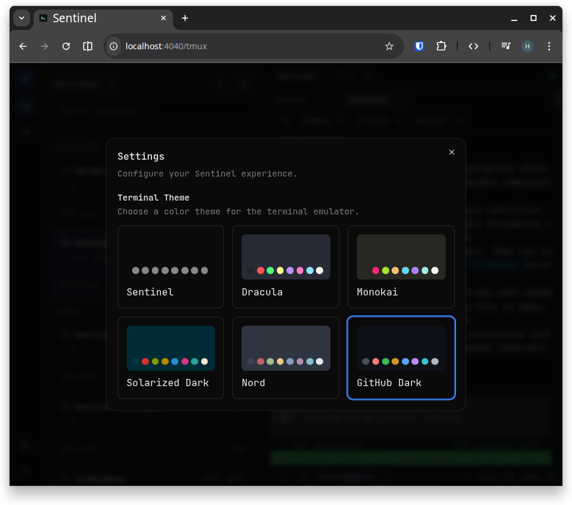
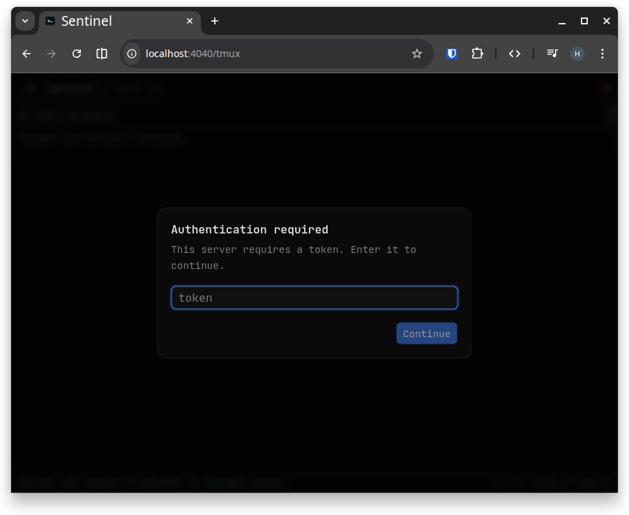

<div align="center">
    
    <hr />
    <p><strong>Your terminal watchtower</strong></p>
    <p>
        <a href="https://goreportcard.com/report/opus-domini/sentinel"></a>
        <a href="https://godoc.org/github.com/opus-domini/sentinel"></a>    
        <a href="https://github.com/opus-domini/sentinel/actions/workflows/ci.yml"></a>
        <a href="https://github.com/opus-domini/sentinel/blob/main/LICENSE"></a>      
    </p>
</div>

Sentinel is a terminal-first workspace delivered as a single binary.
It gives you an interactive browser UI to manage tmux sessions, run standalone terminals, and inspect active host terminals in one place.

No Electron. No cloud relay. Just your machine and your shell.

## Why Sentinel?

- Real PTY terminals in the browser.
- tmux session, window, and pane control with live attach.
- Built-in tmux recovery journal with restore after reboot/power loss.
- Standalone shell tabs that are not tied to tmux.
- Optional token auth and origin validation.
- One binary and simple operations.

## Screenshots

### Desktop

Session and pane management with full tmux visibility.


Interactive terminal focused on the active workspace.


### Mobile

Responsive terminal workflow with touch-first controls.

<p align="center">
  
</p>

### Settings

Theme customization and terminal identity tuning.



Token authentication setup for protected access.



## Quick Start

### 1) Recommended: GitHub release installer

```bash
curl -fsSL https://raw.githubusercontent.com/opus-domini/sentinel/main/install.sh | bash
```

What `install.sh` does on Linux:

- regular user:
  - installs binary to `~/.local/bin/sentinel`
  - installs `~/.config/systemd/user/sentinel.service`
  - starts or restarts the service (`systemctl --user start|restart sentinel`)
- root:
  - installs binary to `/usr/local/bin/sentinel`
  - installs `/etc/systemd/system/sentinel@.service`
  - starts or restarts `sentinel@root` (or `sentinel@$SYSTEMD_TARGET_USER`)
- optional persistence:
  - `systemctl --user enable sentinel` (regular user)
  - `systemctl enable sentinel@root` (root)

### 2) Go install

```bash
go install github.com/opus-domini/sentinel/cmd/sentinel@latest
```

Or from local checkout:

```bash
go install ./cmd/sentinel
```

Go puts the binary in `GOBIN` (or `$(go env GOPATH)/bin` when `GOBIN` is empty).
If needed:

```bash
export PATH="$(go env GOPATH)/bin:$PATH"
```

For development from source, see `CONTRIBUTING.md`.

## After Installation (User Journey)

### 1) Confirm service status

`install.sh` already starts (or restarts, if already running) the service for you.

If installed as regular user:

```bash
systemctl --user status sentinel
journalctl --user -u sentinel -f
```

If installed as root:

```bash
systemctl status sentinel@root
journalctl -u sentinel@root -f
```

If you used `SYSTEMD_TARGET_USER`, replace `root` with that user in the unit name.

Optional: persist across reboot/login.

```bash
# regular user
systemctl --user enable sentinel

# root/system install
systemctl enable sentinel@root
```

If you used `SYSTEMD_TARGET_USER`, enable `sentinel@your-user` instead.

### 2) Open Sentinel

Open `http://127.0.0.1:4040`.

Default binding is local-only (`127.0.0.1:4040`).

### 3) Edit config file (recommended)

Sentinel uses:

- config file: `~/.sentinel/config.toml`
- data dir: `~/.sentinel`

The config file is created on first startup.

## CLI Subcommands

- `sentinel` or `sentinel serve`: start server.
- `sentinel service install`: install systemd user service (Linux).
- `sentinel service uninstall`: remove systemd user service (Linux).
- `sentinel service status`: show service state.
- `sentinel doctor`: print environment diagnostics.
- `sentinel recovery list`: list persisted recovery sessions.
- `sentinel recovery restore`: restore snapshot from local recovery journal.
- `sentinel -h` / `sentinel --help`: help.
- `sentinel -v` / `sentinel --version`: version.

Examples:

```bash
sentinel serve
sentinel service install
sentinel service status
sentinel doctor
sentinel recovery list
sentinel recovery restore -snapshot 42
sentinel --help
sentinel --version
```

## Configuration File (Recommended)

By default Sentinel listens on:

```toml
listen = "127.0.0.1:4040"
```

For remote access, update `~/.sentinel/config.toml`:

```toml
listen = "0.0.0.0:4040"
token = "strong-token"
allowed_origins = ["https://sentinel.example.com"]
log_level = "info"
```

After editing config, restart the service.

Regular user service:

```bash
systemctl --user restart sentinel
```

Root/system service:

```bash
systemctl restart sentinel@root
```

If you used `SYSTEMD_TARGET_USER`, restart `sentinel@your-user` instead.

Security recommendations:

- never expose Sentinel without token auth;
- prefer private networking (Tailscale) or authenticated Cloudflare Tunnel;
- set `allowed_origins` explicitly when using reverse proxies.

## Advanced: Environment Variables

Environment variables override config file values and are useful for technical/automation scenarios.

| Environment variable | Config key | Default | Description |
| --- | --- | --- | --- |
| `SENTINEL_LISTEN` | `listen` | `127.0.0.1:4040` | Listen address |
| `SENTINEL_TOKEN` | `token` | disabled | Bearer token for API and WS auth |
| `SENTINEL_ALLOWED_ORIGINS` | `allowed_origins` | auto | Comma-separated allowlist |
| `SENTINEL_LOG_LEVEL` | `log_level` | `info` | `debug`, `info`, `warn`, `error` |
| `SENTINEL_DATA_DIR` | n/a | `~/.sentinel` | Data directory |
| `SENTINEL_WATCHTOWER_ENABLED` | `watchtower_enabled` | `true` | Enable watchtower activity projector |
| `SENTINEL_WATCHTOWER_TICK_INTERVAL` | `watchtower_tick_interval` | `1s` | Activity collection interval |
| `SENTINEL_WATCHTOWER_CAPTURE_LINES` | `watchtower_capture_lines` | `80` | Lines captured per pane tail |
| `SENTINEL_WATCHTOWER_CAPTURE_TIMEOUT` | `watchtower_capture_timeout` | `150ms` | Timeout per pane capture |
| `SENTINEL_WATCHTOWER_JOURNAL_ROWS` | `watchtower_journal_rows` | `5000` | Max activity journal rows retained |
| `SENTINEL_RECOVERY_ENABLED` | `recovery_enabled` | `true` | Enable recovery journal/restore engine |
| `SENTINEL_RECOVERY_SNAPSHOT_INTERVAL` | `recovery_snapshot_interval` | `5s` | Snapshot polling interval |
| `SENTINEL_RECOVERY_MAX_SNAPSHOTS` | `recovery_max_snapshots` | `300` | Max snapshots retained per session |

## Watchtower Observability

Sentinel exposes watchtower operational state via API:

- `GET /api/tmux/activity/stats`: current runtime counters and last collect metadata.
- `GET /api/tmux/activity/delta?since=<rev>&limit=<n>`: journal deltas by `globalRev`.

Key fields in `/api/tmux/activity/stats`:

- `collectTotal`: total collect cycles since startup.
- `collectErrorsTotal`: collect cycles that returned error.
- `lastCollectDurationMs`: duration of latest cycle.
- `lastCollectSessions`: sessions seen in latest cycle.
- `lastCollectChanged`: sessions with effective activity change in latest cycle.
- `globalRev`: latest persisted activity revision.

For local performance baselines, run:

```bash
go test -run=^$ -bench=BenchmarkCollectFiftyPanes -benchmem ./internal/watchtower
```

### Realtime Diagnostics (Frontend)

The tmux route publishes client runtime counters to:

- `window.__SENTINEL_TMUX_METRICS`

Useful fields:

- `wsMessages`, `wsOpenCount`, `wsCloseCount`, `wsReconnects`
- `sessionsRefreshCount`, `inspectorRefreshCount`, `recoveryRefreshCount`
- `fallbackRefreshCount` (poll fallback executions while events WS is down)
- `deltaSyncCount`, `deltaSyncErrors`, `deltaOverflowCount`

Expected healthy behavior:

- while `/ws/events` is connected, no periodic polling loops for windows/panes;
- `sessionsRefreshCount` should increase mostly on explicit actions or structural events;
- `fallbackRefreshCount` should stay flat unless websocket is disconnected.

## Current Limitations

- Host support: Linux and macOS only.
- Windows is not supported yet.
- tmux workflows require `tmux` installed on the host.
- Recovery restores session structure/context, not in-memory process state.
- No multi-tenant RBAC yet.

## Development

```bash
make dev
make build
make test
make test-client
make lint
make lint-client
make ci
```

## Release Process

- Versioning and release notes are automated by `release-please` on `main`.
- Follow Conventional Commits (`feat:`, `fix:`, `feat!:`...) so version bumps and changelogs are accurate.
- When a release is created, CI builds and uploads platform archives to that GitHub release automatically.
- Manual tag releases are still supported via `.github/workflows/release.yml` and now always include generated notes.
- Required GitHub setting for the default `GITHUB_TOKEN` path:
  - `Settings` -> `Actions` -> `General` -> `Workflow permissions`
  - enable `Read and write permissions`
  - enable `Allow GitHub Actions to create and approve pull requests`

## Contributing

Pull requests are welcome.

1. Fork repository
2. Create a feature branch
3. Run `make ci`
4. Open a pull request
