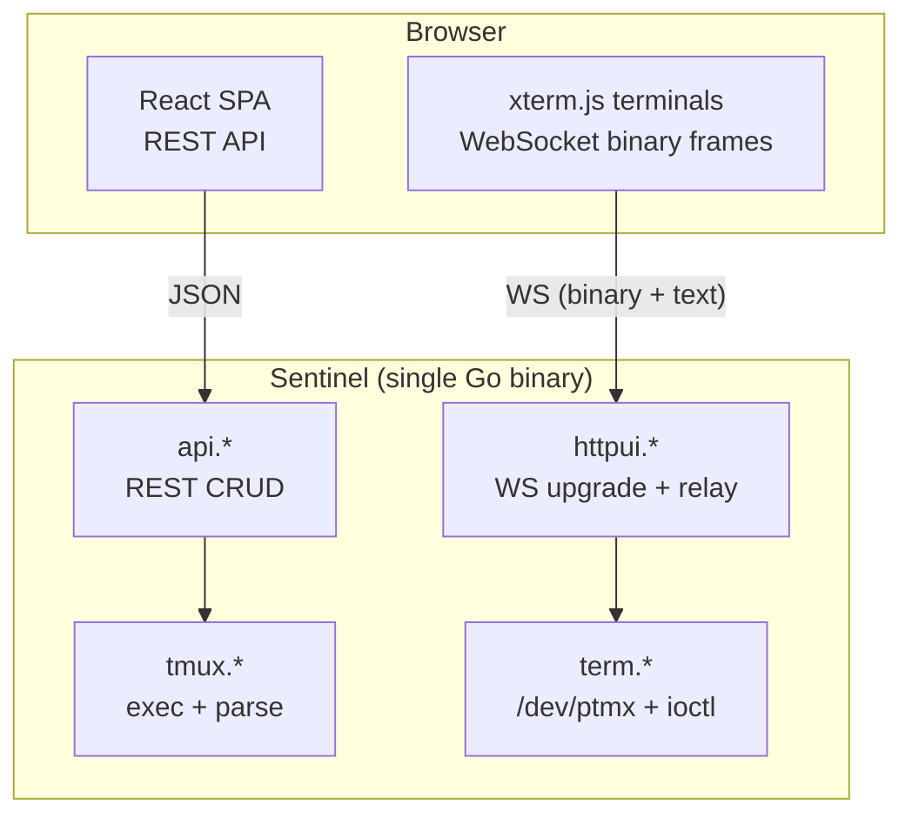

<div align="center">
    
    <hr />    
    <p>Your local development environment, in the browser.</p>
</div>

Sentinel is a lightweight terminal workspace that runs as a single binary on your machine. It gives you a browser-based IDE-like interface to manage tmux sessions, spawn standalone terminals, and monitor running processes — all over WebSocket-attached PTY connections with full terminal emulation.

One external Go dependency (pure-Go SQLite). No Electron. No cloud. Just a single binary that serves everything.

## Table of Contents

- [Why Sentinel?](#why-sentinel)
- [Features](#features)
- [Quick Start](#quick-start)
- [Install as a Service](#install-as-a-service)
- [Configuration](#configuration)
- [Architecture](#architecture)
- [API Reference](#api-reference)
- [Development](#development)
- [Contributing](#contributing)

## Why Sentinel?

- **Real terminals in the browser**: Full PTY-backed terminal emulation via xterm.js — not a simulation, not a web shell. Real `ioctl`, real resize, real tmux attach.
- **Two terminal modes**: Manage your tmux sessions with full window/pane control, or spawn standalone shell terminals independent of tmux.
- **System visibility**: See every running terminal and process on your machine from a single dashboard.
- **Single binary, zero runtime deps**: The entire backend is Go stdlib-only. Frontend assets are embedded at compile time. Download, run, done.
- **Secure by default**: Loopback-only binding, origin enforcement, and optional bearer token auth. Your terminals never leave your machine.
- **Extensible foundation**: Clean REST API, WebSocket protocol, and modular Go architecture — ready to grow into whatever your workflow needs.

## Features

**tmux integration**
- Discover, create, rename, and kill tmux sessions
- Window management — create, switch, close
- Pane management — split (vertical/horizontal), focus, close
- Attach browser terminals to tmux sessions with real-time I/O

**Standalone terminals**
- Spawn shell terminals independent of tmux
- Multiple concurrent terminal tabs
- System terminal discovery and monitoring

**Interface**
- IDE-like layout with collapsible sidebar, resizable panels, and session tabs
- Dark-first design with shadcn/Radix UI components
- Terminal color themes — Sentinel, Dracula, Monokai, Solarized Dark, Nord, GitHub Dark
- Responsive — works on desktop and mobile viewports
- Mobile terminal controls — virtual DPad (arrow keys), NumPad, Ctrl/Esc/Tab toolbar
- Real-time connection status and toast notifications

**Mobile support**
- Virtual control toolbar on mobile viewports: Ctrl modifier, Esc, Backspace, Enter, Tab, keyboard toggle
- Font size controls: zoom in/out buttons on the toolbar, persisted across sessions (8px–24px range)
- DPad: long-press joystick for arrow key navigation with auto-repeat and distance-based speed
- NumPad: long-press number grid for digit input via drag-and-release
- iOS visual viewport tracking to handle keyboard resize and safe areas
- Haptic feedback on touch interactions

**Infrastructure**
- Native RFC 6455 WebSocket implementation (no gorilla, no nhooyr)
- Platform-specific PTY via `/dev/ptmx` and ioctl (Linux + macOS)
- WebSocket keepalive with ping/pong
- Graceful server shutdown on SIGINT/SIGTERM
- Optional token-based authentication with blocking gate dialog
- Auto-generated config file (`~/.sentinel/config.toml`) with documented defaults
- SQLite session metadata persistence (pure-Go, no CGO)

## Quick Start

**Requirements (from source):** Go 1.25+, Node.js 20+, npm, tmux, Linux or macOS.

```bash
git clone https://github.com/opus-domini/sentinel.git
cd sentinel
make run
```

Open [http://127.0.0.1:4040](http://127.0.0.1:4040) in your browser.

To build a standalone binary:

```bash
make build
./build/sentinel
```

## Install as a Service

Sentinel can run as a background service that starts automatically on login.

### Quick install (from source)

```bash
make install
systemctl --user enable --now sentinel
```

This installs the binary to `~/.local/bin/` and sets up a systemd user service. View logs with `journalctl --user -u sentinel -f`.

The bundled service uses `KillMode=process` so `systemctl restart sentinel` does not terminate the tmux server and existing tmux sessions.
If you installed an older unit, run `make install` again and then `systemctl --user daemon-reload`.

### Install script (from GitHub Releases)

```bash
curl -fsSL https://raw.githubusercontent.com/opus-domini/sentinel/main/install.sh | bash
```

The script downloads the latest release binary, installs it to `~/.local/bin/`, and configures the systemd user service. You can customize the install directory with `INSTALL_DIR=/usr/local/bin` or pin a version with `VERSION=v1.0.0`.

### Manual setup

If you prefer to set things up yourself:

```bash
# Copy the binary
install -Dm755 build/sentinel ~/.local/bin/sentinel

# Install the systemd user service
mkdir -p ~/.config/systemd/user
cp contrib/sentinel.service ~/.config/systemd/user/

# Enable and start
systemctl --user daemon-reload
systemctl --user enable --now sentinel
```

### Start at boot (optional)

By default, user services only run when the user is logged in. To start Sentinel at boot without a login session:

```bash
sudo loginctl enable-linger $USER
```

### System service (headless servers)

For servers where Sentinel should run as a specific user via a system-level service:

```bash
sudo cp contrib/sentinel@.service /etc/systemd/system/
sudo systemctl daemon-reload
sudo systemctl enable --now sentinel@youruser
```

### Uninstall

```bash
make uninstall
```

Or manually:

```bash
systemctl --user disable --now sentinel
rm ~/.local/bin/sentinel
rm ~/.config/systemd/user/sentinel.service
systemctl --user daemon-reload
```

## Configuration

On first run Sentinel creates `~/.sentinel/config.toml` with all options commented out and documented. Edit the file or use environment variables — env vars always take precedence.

| Variable | Config key | Default | Description |
|----------|-----------|---------|-------------|
| `SENTINEL_LISTEN` | `listen` | `127.0.0.1:4040` | Listen address |
| `SENTINEL_TOKEN` | `token` | _(disabled)_ | Bearer token for API and WebSocket auth |
| `SENTINEL_ALLOWED_ORIGINS` | `allowed_origins` | _(auto)_ | Comma-separated origin allowlist |
| `SENTINEL_LOG_LEVEL` | `log_level` | `info` | Log level: debug, info, warn, error |
| `SENTINEL_DATA_DIR` | — | `~/.sentinel` | Data directory (config, database) |

```bash
SENTINEL_TOKEN=my-secret make run
```

## Architecture



| Package | Role |
|---------|------|
| `api` | JSON REST handlers for tmux and terminal CRUD |
| `httpui` | SPA serving, WebSocket upgrade and PTY relay |
| `tmux` | tmux CLI wrapper with context timeouts and output parsing |
| `ws` | Stdlib-only RFC 6455 WebSocket implementation |
| `term` | Platform-specific PTY via `/dev/ptmx` and ioctl |
| `terminals` | In-memory registry of active terminal connections |
| `security` | Origin validation and bearer token auth |
| `config` | Config file + environment-based configuration |
| `store` | SQLite session metadata persistence |
| `validate` | Shared input validators |

**Frontend**: React 19 + TanStack Router + Tailwind CSS v4 + shadcn/Radix UI + xterm.js. Built with Vite, embedded in the Go binary via `//go:embed`.

## API Reference

### REST

All responses use the envelope `{ "data": ... }` or `{ "error": { "message": "..." } }`.

**tmux sessions**

| Method | Endpoint | Description |
|--------|----------|-------------|
| `GET` | `/api/tmux/sessions` | List all sessions |
| `POST` | `/api/tmux/sessions` | Create a session |
| `PATCH` | `/api/tmux/sessions/{session}` | Rename a session |
| `DELETE` | `/api/tmux/sessions/{session}` | Kill a session |
| `GET` | `/api/tmux/sessions/{session}/windows` | List windows |
| `GET` | `/api/tmux/sessions/{session}/panes` | List panes |
| `POST` | `/api/tmux/sessions/{session}/select-window` | Switch active window |
| `POST` | `/api/tmux/sessions/{session}/select-pane` | Switch active pane |
| `POST` | `/api/tmux/sessions/{session}/new-window` | Create a window |
| `POST` | `/api/tmux/sessions/{session}/kill-window` | Close a window |
| `POST` | `/api/tmux/sessions/{session}/kill-pane` | Close a pane |
| `POST` | `/api/tmux/sessions/{session}/split-pane` | Split a pane |

**Standalone terminals**

| Method | Endpoint | Description |
|--------|----------|-------------|
| `GET` | `/api/terminals` | List system terminals |
| `GET` | `/api/terminals/system/{tty}` | Get processes for a system terminal |
| `DELETE` | `/api/terminals/{terminal}` | Close a terminal |

### WebSocket

| Endpoint | Description |
|----------|-------------|
| `GET /ws/tmux?session={name}` | Attach to a tmux session |
| `GET /ws/terminals?terminal={name}` | Attach to a standalone terminal |

Binary frames carry raw terminal I/O. Text frames carry JSON control messages (`resize`, `status`, `error`).

## Development

### Build targets

```bash
make run              # Run server (go run)
make dev              # Run Go server + Vite dev server concurrently
make dev-client       # Vite dev server only (proxies to :4040)
make build            # Build frontend + Go binary
make build-server     # Build Go binary only
make build-client     # Build frontend to client/dist/assets
make client-install   # Install frontend dependencies
make install          # Install binary + systemd user service
make uninstall        # Remove binary + systemd user service
```

### Quality checks

```bash
make test             # Go tests
make test-coverage    # Tests with -race and coverage
make benchmark        # Go benchmarks
make fmt              # golangci-lint fmt
make lint             # golangci-lint run (includes gosec)
make lint-client      # Frontend eslint
make test-client      # Frontend vitest
make ci               # Full pipeline
```

Frontend (from `client/`):

```bash
npm test              # vitest
npm run check         # prettier + eslint --fix
```

### Project structure

```
cmd/sentinel/          Entry point
internal/
  api/                 REST handlers (tmux + terminals)
  config/              Config file + environment-based configuration
  store/               SQLite session metadata persistence
  httpui/              SPA serving and WebSocket handlers
  security/            Origin and token validation
  term/                PTY implementation (linux/darwin)
  terminals/           Active terminal registry
  tmux/                tmux CLI wrapper and output parsing
  ws/                  RFC 6455 WebSocket implementation
  validate/            Shared input validators
client/
  src/                 React/TypeScript sources
  dist/                Built assets (generated during build for go:embed)
contrib/
  sentinel.service     systemd user service unit
  sentinel@.service    systemd system template unit
install.sh             Installer script (curl | bash)
```

## Contributing

Contributions are welcome.

1. Fork the repository
2. Create a feature branch (`git checkout -b feature/my-feature`)
3. Make your changes and ensure checks pass (`make ci`)
4. Commit and open a pull request
