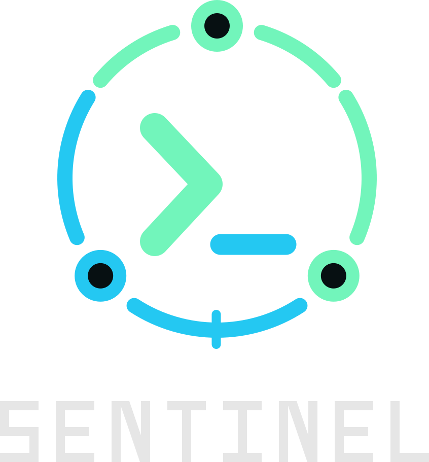
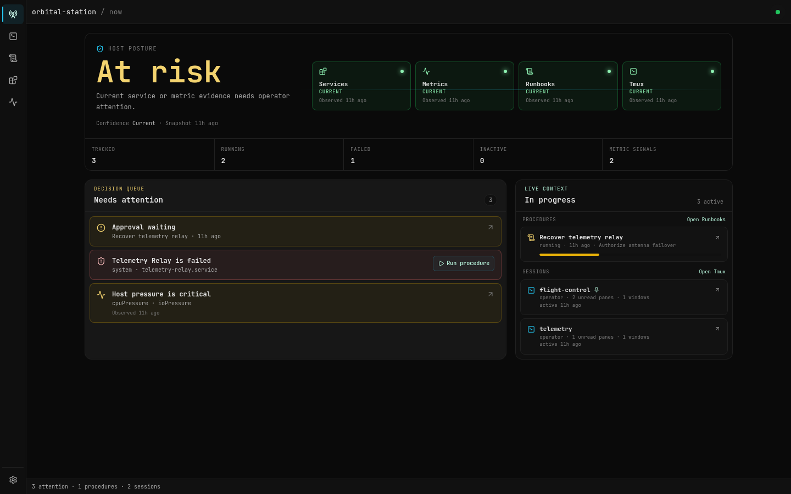
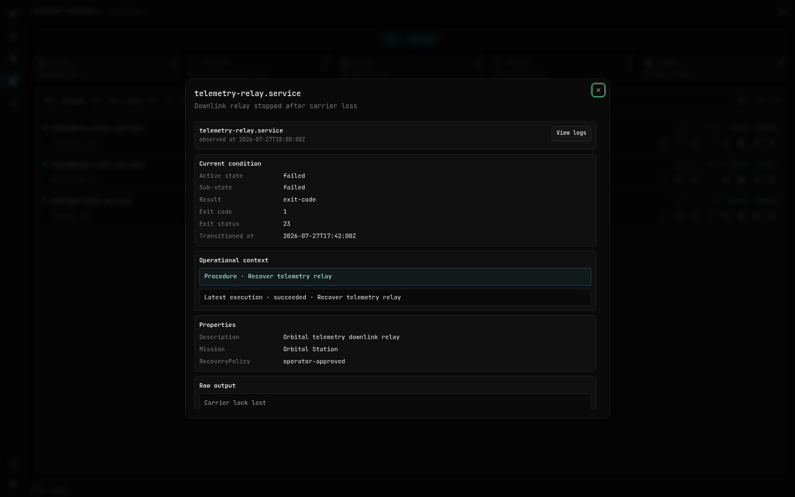
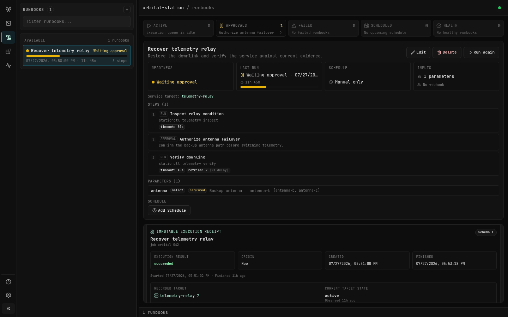
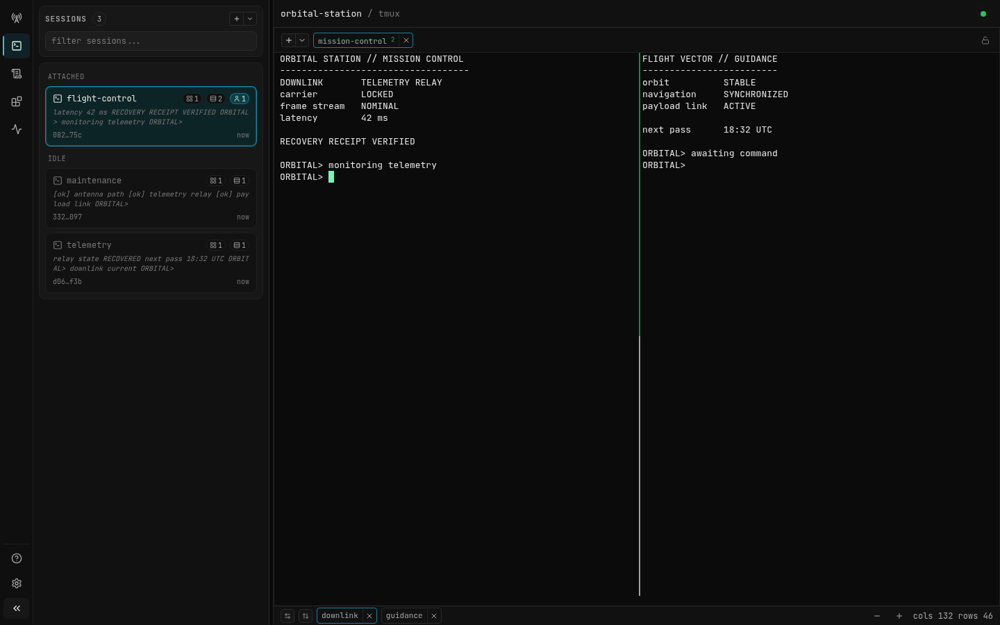
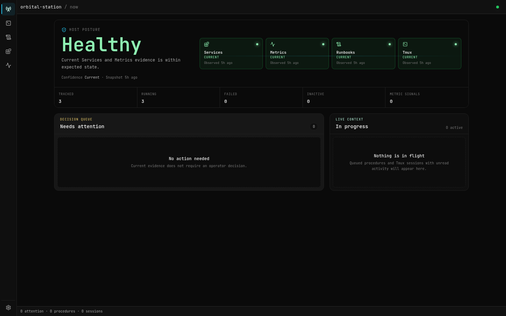

<div align="center">
    
    <hr />
    <p><strong>Local-first host operations, from signal to verified action.</strong></p>
    <p>
        <a href="https://pkg.go.dev/github.com/opus-domini/sentinel"></a>
        <a href="https://github.com/opus-domini/sentinel/actions/workflows/ci.yml"></a>
        <a href="https://github.com/opus-domini/sentinel/blob/main/LICENSE"></a>
        <a href="https://github.com/opus-domini/sentinel/releases"></a>
    </p>
</div>

Sentinel is a local-first operational workspace for one host. It gives a
trusted operator one place to understand what needs attention, follow current
evidence into the module that owns it, act deliberately, and verify the result
without sending terminal or host state through a cloud relay.

**Now** is the entrance and the return point. It composes the current picture
from four owners: **Tmux** for live terminal context, **Services** for condition
and lifecycle, **Metrics** for host pressure, and **Runbooks** for explicit
procedures and immutable execution receipts.

No Electron. No SaaS dependency. One Go binary, an embedded React UI, SQLite,
and the tools already present on your host.

<p align="center">
  <a href="https://opus-domini.github.io/sentinel/">Documentation</a> •
  <a href="https://github.com/opus-domini/sentinel/releases">Releases</a> •
  <a href="#quick-start">Quick Start</a>
</p>

## The Daily Operational Loop

1. Open **Now** and read posture, evidence confidence, the bounded decision
   queue, and work already in progress.
2. Follow the typed handoff to **Tmux**, **Services**, **Metrics**, or
   **Runbooks** instead of diagnosing in a duplicate dashboard.
3. Act in the owner module. Service procedures keep their target, parameters,
   approval boundary, and result together.
4. Verify current state independently from the historical execution receipt.
5. Return to **Now**. When current evidence is calm, the queue is calm.

Now coordinates this loop; it is not a fifth execution domain, alert inbox,
incident record, or recovery timeline.

## One Loop, End to End

The screens below come from the real Sentinel frontend and an isolated,
disposable daemon running the fictitious **Orbital Station** workload. The
names and telemetry are demonstration data; Sentinel does not provide
satellite-specific behavior.

Now starts with a bounded decision queue and sends each signal to its owner:



Services owns the condition and the path from structured evidence to the
relevant procedure or prior execution:



Runbooks keeps the accepted procedure, result, target, and current recheck
together without confusing the historical receipt with present state:



Tmux remains the live workspace where the operator can continue daily work:



After current owner evidence is healthy, Now becomes calm again:



## What Sentinel Owns

### Daily core

- **Now** — current host posture, source confidence, operator decisions, live
  work, and reload-safe handoffs.
- **Tmux** — existing sessions, interactive PTYs, windows, panes, unread
  context, and reusable launchers.
- **Services** — tracked and browsed systemd/launchd units, structured
  condition, logs, and verified lifecycle actions.
- **Metrics** — live host and Sentinel runtime signals, with explicit pressure
  posture rather than causal guesses.
- **Runbooks** — reviewable procedures, target admission, parameters,
  approvals, schedules, job history, and immutable receipts.

### Platform operation

- Single-binary installation and user/system service lifecycle on Linux and
  macOS.
- Optional shared-token authentication and explicit origin policy.
- Local SQLite persistence for operational definitions, execution records,
  service tracking, and Tmux projections.
- Daily autoupdate service and CLI diagnostics.

### Extensions

- **OS Account Targeting** — launch Tmux work under allowed operating-system
  accounts. These are host accounts, not Sentinel identities.
- **MCP** — expose bounded Sentinel tools to a trusted local agent using the
  same shared secret.
- **Mobile/PWA** — use the same five destinations from a touch-oriented shell.

## How Sentinel Grew

Sentinel began as a browser workspace around Tmux. As host controls were added,
independent alert, recovery, timeline, and scheduling concepts started to
inflate the domain without producing one coherent daily workflow.

The product was cut back to what has a clear owner and a concrete handoff.
Tmux, Services, Metrics, and Runbooks retained distinct responsibilities; Now
became the composition layer that connects them. Sentinel is therefore no
longer defined by terminal access alone. Its focus is the complete local loop
from current signal to verified action.

## Requirements

- Linux or macOS host.
- `tmux` for terminal workspace features.
- A modern browser with WebSocket support.

## Quick Start

Install the latest release:

```bash
curl -fsSL https://raw.githubusercontent.com/opus-domini/sentinel/main/install.sh | bash
```

Confirm the installation and service:

```bash
sentinel doctor
sentinel service status
```

Open `http://127.0.0.1:4040`. If a token is configured, the dedicated
authentication gate asks for that shared secret before loading the workspace.

Start at **Now**:

- open a failed service in Services for condition and logs;
- open a pressure signal in Metrics for live context;
- open an approval or execution in Runbooks;
- open an active session in Tmux.

Create tracked services, Runbooks, or account-targeted launchers only when an
actual recurring operation needs them.

## Trust Boundary

Sentinel is designed for a trusted operator boundary around one host.

- The optional token is one shared secret, not a user account.
- Sentinel has no application identities, roles, RBAC, tenants, or per-agent
  scopes.
- OS accounts selected for Tmux remain operating-system identities; they do
  not become Sentinel users.
- MCP agents use the same shared trust boundary and cannot satisfy human
  approval steps.
- If Sentinel listens beyond loopback, configure both `token` and
  `allowed_origins` and place transport security at the network edge.

## Current Non-goals

- Fleet or multi-host orchestration.
- SaaS observability or cloud telemetry retention.
- An incident engine, alert inbox, acknowledgement workflow, or recovery
  timeline.
- Sentinel application users, identities, RBAC, tenancy, or delegated agent
  approval.

## Documentation

- [Getting Started](https://opus-domini.github.io/sentinel/#/guide/getting-started)
- [Operational Loop](https://opus-domini.github.io/sentinel/#/features/operational-loop)
- [Architecture](https://opus-domini.github.io/sentinel/#/guide/architecture)
- [Security](https://opus-domini.github.io/sentinel/#/guide/security)
- [CLI Reference](https://opus-domini.github.io/sentinel/#/reference/cli)
- [HTTP API](https://opus-domini.github.io/sentinel/#/reference/http-api)
- [WebSocket and Events](https://opus-domini.github.io/sentinel/#/reference/websockets-events)
- [Troubleshooting](https://opus-domini.github.io/sentinel/#/troubleshooting/common-issues)
