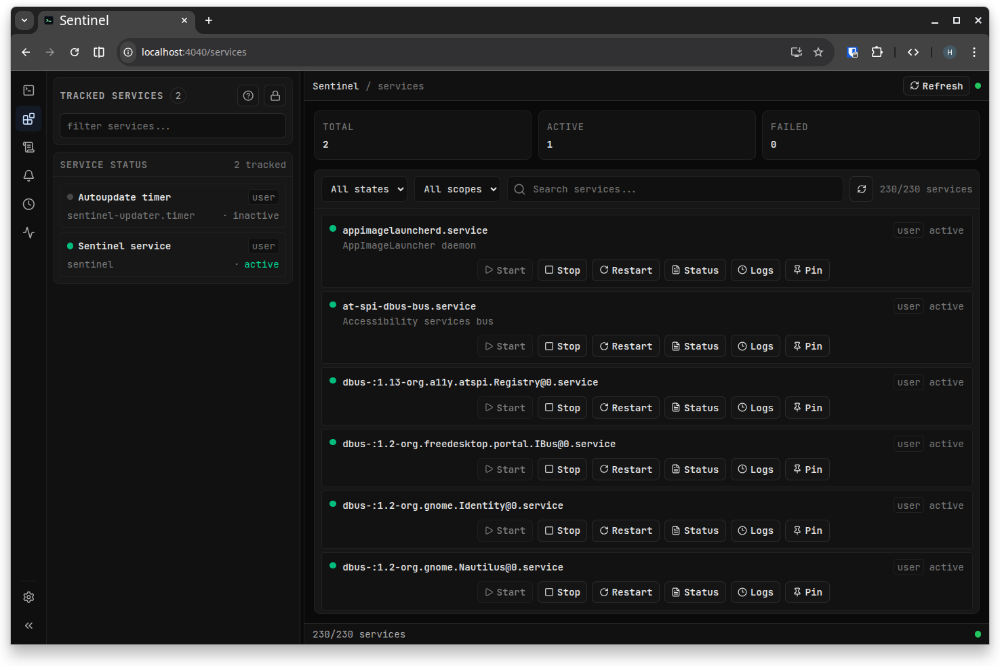
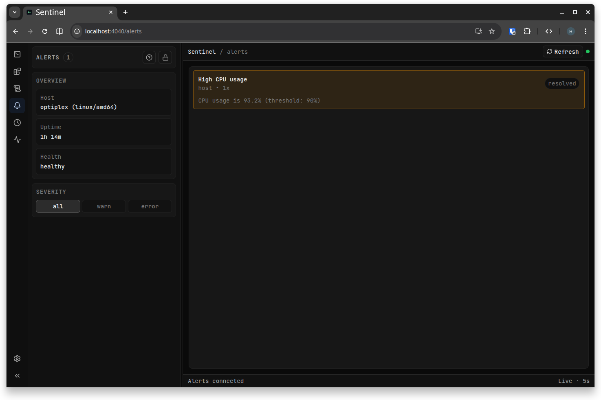
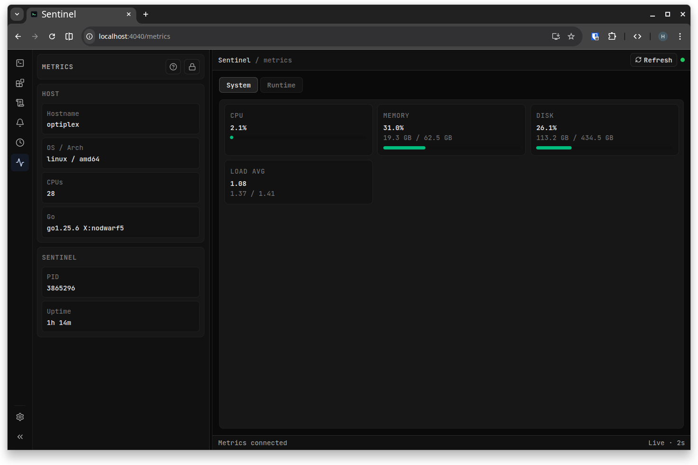
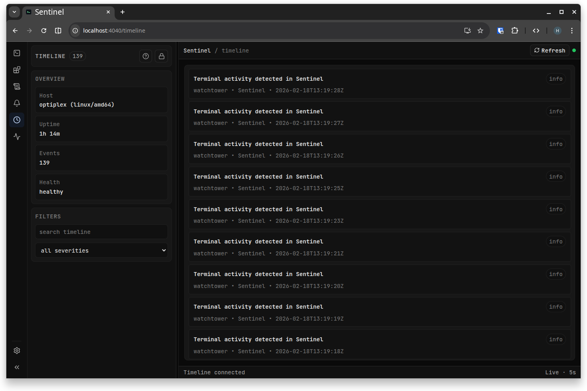
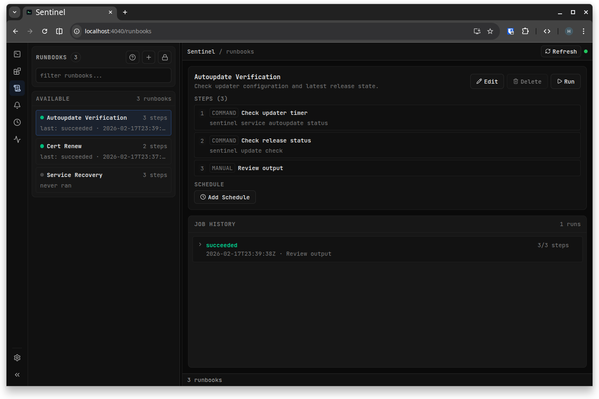
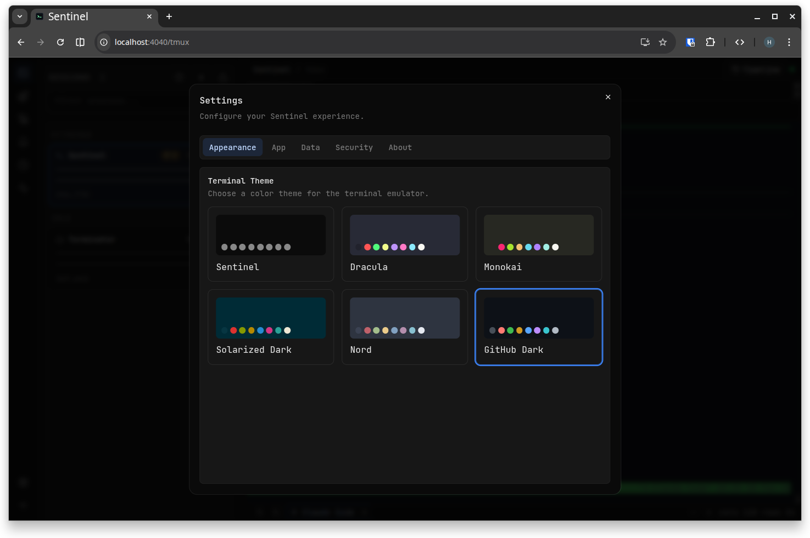
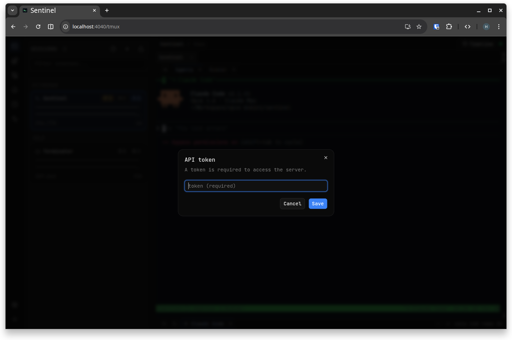

<div align="center">
  
  <hr />
  <p><strong>Your terminal watchtower</strong></p>
</div>

Sentinel is a host operations platform delivered as a single binary.
It provides tmux session control, service monitoring, alerts, metrics, runbooks, and recovery workflows in a realtime browser UI.

## What You Will Find Here

- Installation and first-run flow.
- Architecture and security model.
- Deep feature guides for tmux, services, runbooks, alerts, timeline, metrics, recovery, and guardrails.
- Full CLI and API reference.
- Operations runbooks for services, autoupdate, and storage management.
- Mobile/PWA behavior and known troubleshooting patterns.

## Quick Start

### Install

```bash
curl -fsSL https://raw.githubusercontent.com/opus-domini/sentinel/main/install.sh | bash
```

### Open UI

- Default URL: `http://127.0.0.1:4040`
- If token is enabled, authenticate in Settings or with `Authorization: Bearer <token>`.

### Check Runtime

```bash
sentinel doctor
sentinel service status
sentinel service autoupdate status
```

## Navigation

Use the left sidebar as the primary index.
Suggested reading order:

1. `Guide > Getting Started`
2. `Guide > Architecture`
3. `Features > Tmux Workspace`
4. `Features > Ops Control Plane`
5. `Reference > CLI Reference`
6. `Operations > Service and Autoupdate`

## Screenshots

Tip: click any image to zoom.

### Terminal Workspace

> Manage tmux sessions, windows, and panes with realtime sync — no terminal tab juggling.


> Attach to any pane with a full interactive PTY, right in the browser.


> Full terminal control on mobile — touch-optimized with gesture-safe zones.

<p align="center">
  
</p>

### Ops Control Plane

> **Services:** Monitor and control systemd/launchd services with live status, logs, and one-click actions.



> **Alerts:** Catch failures early with deduplicated alerts from watchtower and service health checks.



> **Metrics:** CPU, memory, disk, and runtime stats at a glance — no external agents needed.



> **Timeline:** Searchable audit log of every operation, alert, and service event on your host.



> **Runbooks:** Executable step-by-step procedures with job tracking and per-step output history.



### Settings

> Theme, token auth, storage management, and guardrails — all configurable from the UI.



> Secure your instance with bearer token authentication and origin allowlists.


