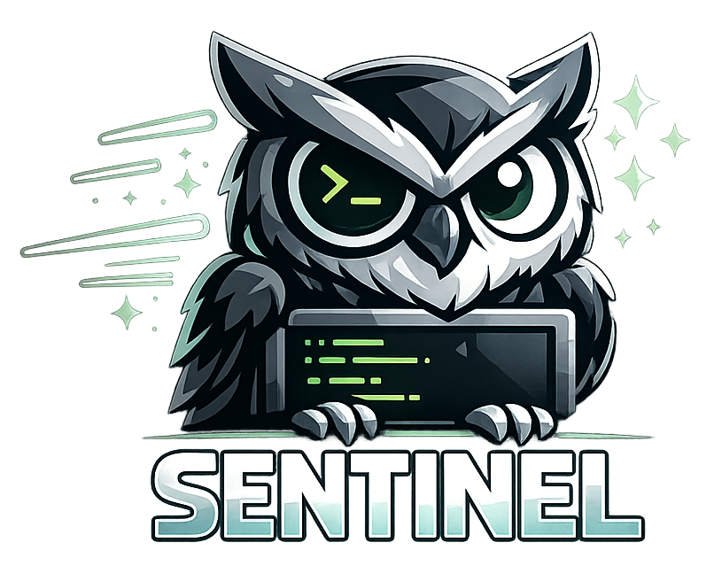
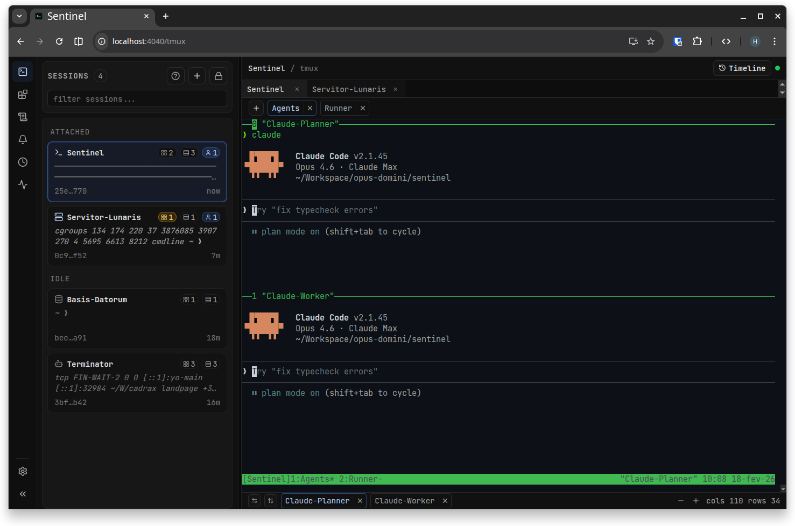
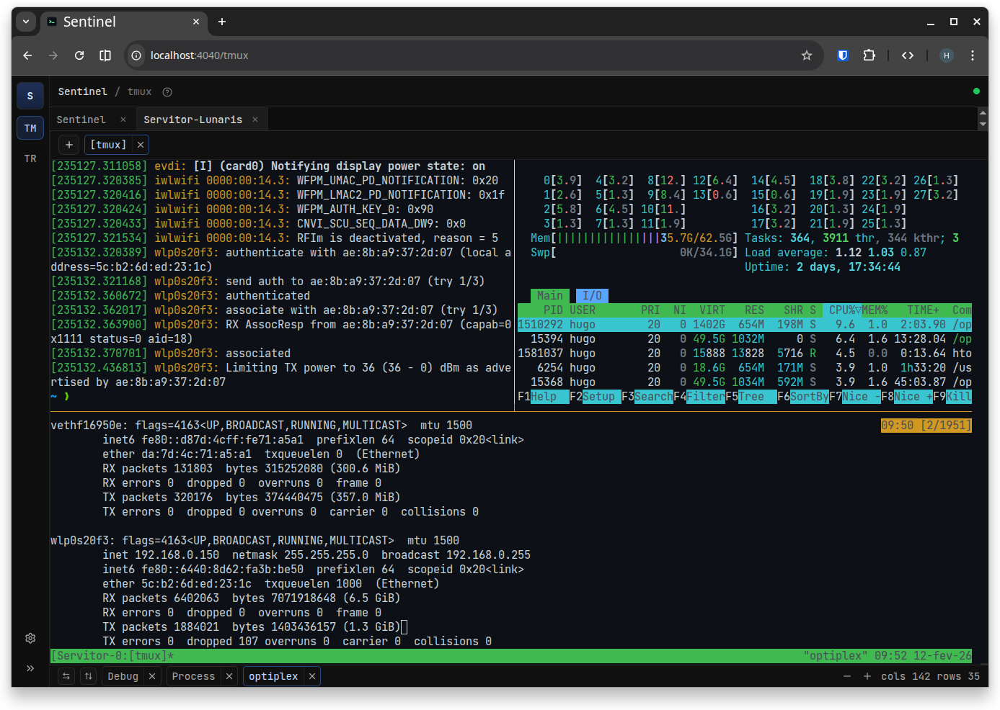
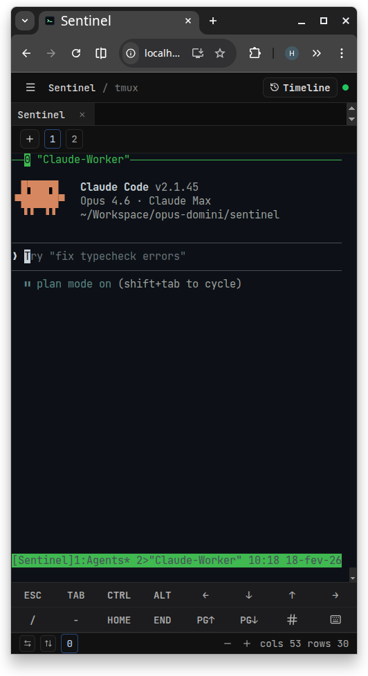

<div align="center">
  
  <hr />
  <p><strong>Your terminal watchtower</strong></p>
</div>

Sentinel is a terminal-first workspace delivered as a single binary.
It provides tmux session control, ops control-plane tooling, realtime activity projection, and recovery workflows in a browser UI.

## What You Will Find Here

- Installation and first-run flow.
- Architecture and security model.
- Deep feature guides for tmux, services, runbooks, alerts, timeline, metrics, recovery, and guardrails.
- Full CLI and API reference.
- Operations runbooks for services, autoupdate, and storage management.
- Mobile/PWA behavior and known troubleshooting patterns.

## Quick Start

### Install

```bash
curl -fsSL https://raw.githubusercontent.com/opus-domini/sentinel/main/install.sh | bash
```

### Open UI

- Default URL: `http://127.0.0.1:4040`
- If token is enabled, authenticate in Settings or with `Authorization: Bearer <token>`.

### Check Runtime

```bash
sentinel doctor
sentinel service status
sentinel service autoupdate status
```

## Navigation

Use the left sidebar as the primary index.
Suggested reading order:

1. `Guide > Getting Started`
2. `Guide > Architecture`
3. `Features > Tmux Workspace`
4. `Features > Ops Control Plane`
5. `Reference > CLI Reference`
6. `Operations > Service and Autoupdate`

## Screenshots

Tip: click any image to zoom.





<p align="center">
  
</p>
