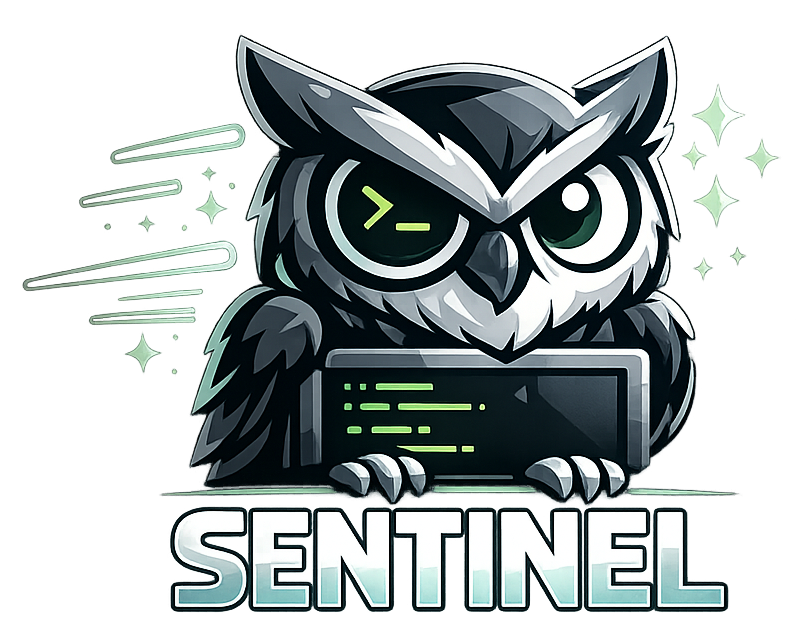

  
  

  
<strong>Local-first host operations, from signal to verified action.</strong>

# Find the Right Operational Path

These docs are organized by intent. Sentinel starts in **Now**, then hands
current evidence to one of four owners: Tmux, Services, Metrics, or Runbooks.
Use the shortest path that answers the question in front of you.

## Start

- [Getting Started](/guide/getting-started.md) — install, validate the service,
  pass the auth gate when configured, and reach first value in Now.
- [Architecture](/guide/architecture.md) — understand the local process,
  composition boundary, owner modules, persistence, and event flow.
- [Security Model](/guide/security.md) — understand the shared secret, origin
  policy, host account boundary, and remote-access requirements.

## Work the Daily Loop

| Intent | Go to | What owns the answer |
| --- | --- | --- |
| What requires attention now? | [Now](/features/now.md) | Current composition and typed handoff |
| How does evidence become verified action? | [Operational Loop](/features/operational-loop.md) | Cross-module ownership, without a second workflow engine |
| Open a terminal or inspect live shell context | [Tmux Workspace](/features/tmux-workspace.md) | Sessions, windows, panes, PTY, and unread context |
| Investigate a service | [Services](/features/services.md) | Condition, logs, lifecycle action, and verification |
| Understand host pressure | [Metrics](/features/metrics.md) | Live samples and canonical pressure posture |
| Execute or audit a procedure | [Runbooks](/features/runbooks.md) | Confirmation, approval, execution, and receipt |

After investigation or action, return to **Now**. It recomposes current owner
evidence instead of retaining a parallel incident or alert record.

## Operate Sentinel

- [Service and Autoupdate](/operations/service-and-autoupdate.md) — install,
  inspect, restart, and update the daemon.
- [Storage and Flush](/operations/storage-and-flush.md) — understand local
  persistence and bounded cleanup.
- [Common Issues](/troubleshooting/common-issues.md) — diagnose known runtime,
  Tmux, auth, service, and browser failures.

## Extend the Workspace

- [OS Account Targeting](/features/os-account-targeting.md) — run Tmux work
  under allowed host accounts without creating Sentinel users.
- [MCP Control](/features/mcp.md) — expose bounded tools inside the same trusted
  operator boundary.
- [Mobile and PWA](/features/mobile-pwa.md) — use the five primary destinations
  from the mobile shell.

## Look Up a Contract

- [CLI Reference](/reference/cli.md)
- [Configuration](/reference/configuration.md)
- [HTTP API](/reference/http-api.md)
- [WebSocket and Events](/reference/websockets-events.md)

Sentinel is intentionally scoped to one trusted host. Fleet management, SaaS
observability, an incident engine, an alert inbox, application identities/RBAC,
and agent approval are current non-goals.
