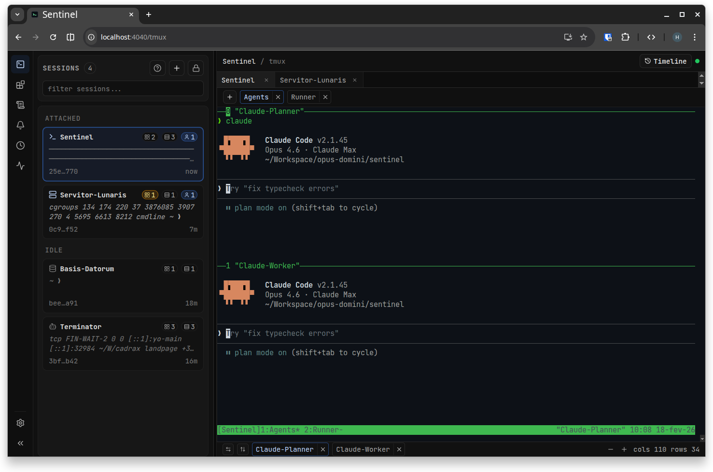
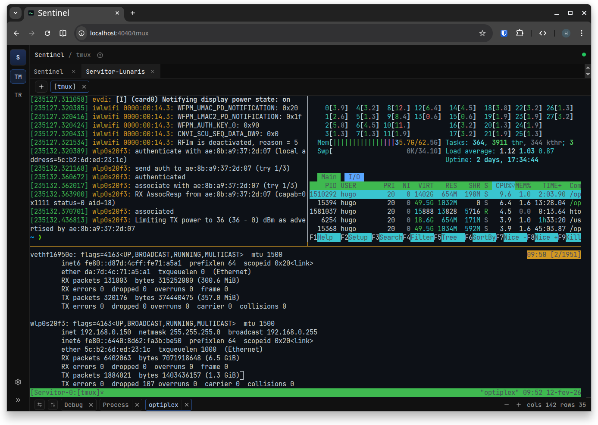
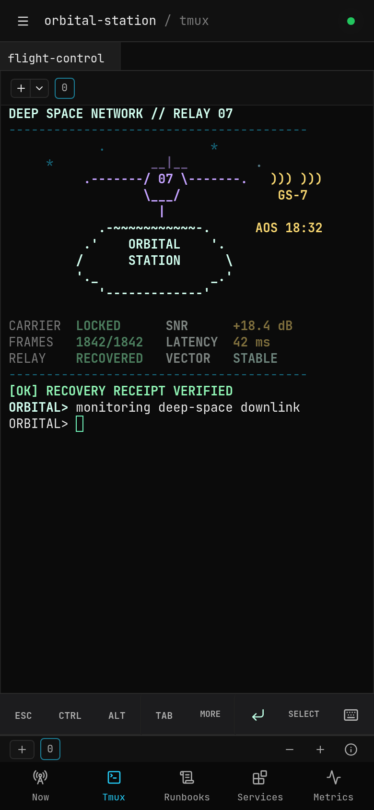
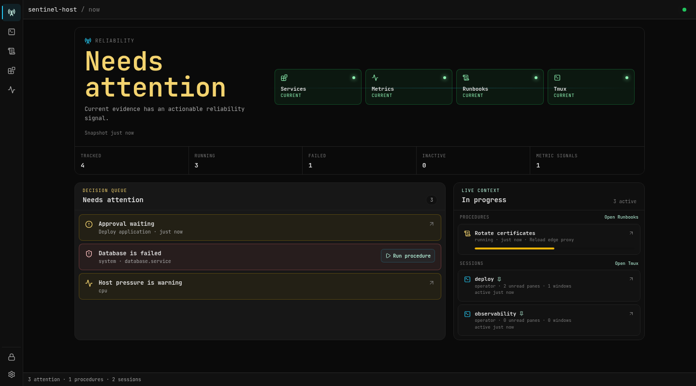
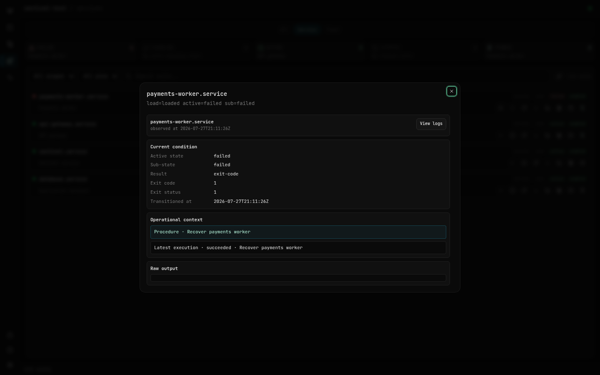
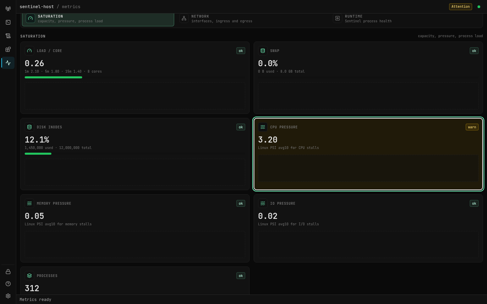
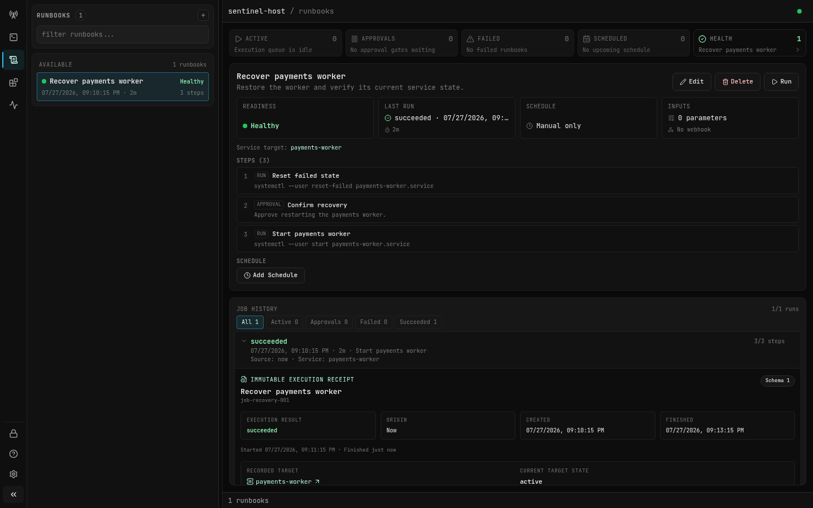
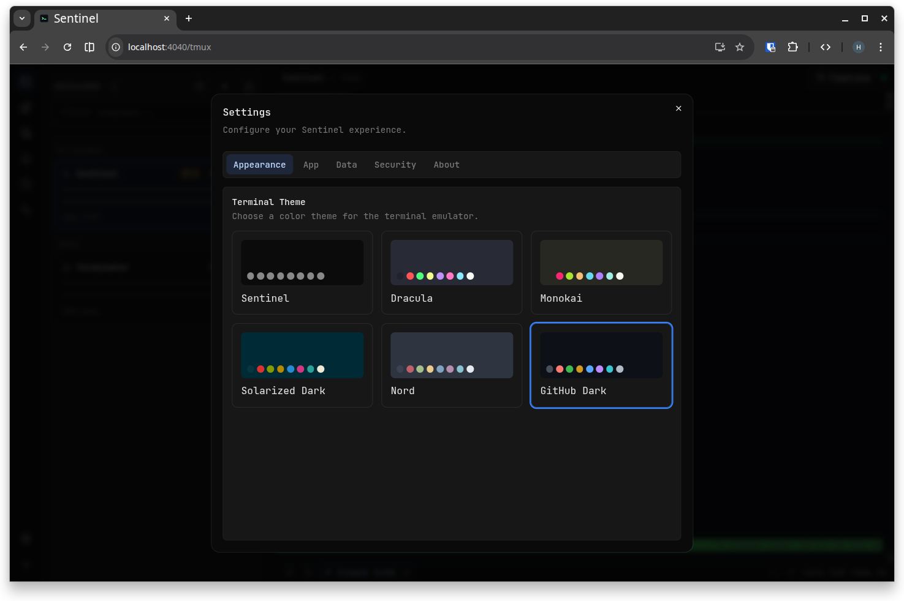
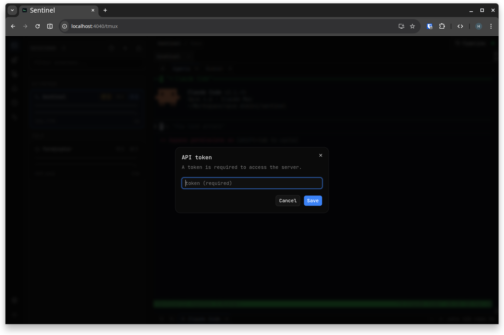

<div align="center">
  
  <hr />
  <p><strong>Your terminal watchtower</strong></p>
</div>

Sentinel is a host operations platform delivered as a single binary.
Its Now home connects tmux activity, service health, host posture, and
operational procedures in one current view, then hands each task to its owner
module.

## What You Will Find Here

- Installation and first-run flow.
- Architecture and security model.
- Deep feature guides for Now, tmux, services, metrics, runbooks, and multi-user sessions.
- Full CLI and API reference.
- Operations runbooks for services, autoupdate, and storage management.
- Mobile/PWA behavior and known troubleshooting patterns.

## Quick Start

### Install

```bash
curl -fsSL https://raw.githubusercontent.com/opus-domini/sentinel/main/install.sh | bash
```

### Open UI

- Default URL: `http://127.0.0.1:4040`
- If token is enabled, authenticate via the Settings dialog in the UI.

### Check Runtime

```bash
sentinel doctor
sentinel service status
sentinel service autoupdate status
```

## Navigation

Use the left sidebar as the primary index.
Suggested reading order:

1. `Guide > Getting Started`
2. `Guide > Architecture`
3. `Features > Tmux Workspace`
4. `Features > Now`
5. `Reference > CLI Reference`
6. `Operations > Service and Autoupdate`

## Screenshots

Tip: click any image to zoom.

### Terminal Workspace

> Manage tmux sessions, windows, and panes with realtime sync — no terminal tab juggling.



> Attach to any pane with a full interactive PTY, right in the browser.



> Full terminal control on mobile — touch-optimized with gesture-safe zones.

<p align="center">
  
</p>

### Ops Control Plane

> **Now:** See host posture, evidence confidence, decisions that need attention, and live operational context before entering an owner module.



> **Services:** Follow current condition into transition-scoped logs, procedure context, and verified lifecycle actions.



> **Metrics:** Inspect live samples and sustained posture signals, including focused handoffs from Now.



> **Runbooks:** Confirm effects, handle approval boundaries, and retain immutable execution receipts with a current target recheck.



### Settings

> Theme, token auth, and storage management — all configurable from the UI.



> Secure your instance with token authentication and origin allowlists.


