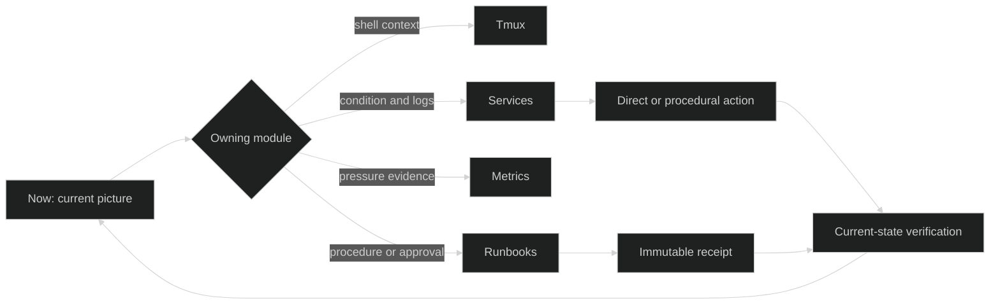

# Operational Loop

Sentinel connects four owner modules through one bounded local workflow. **Now**
is the entry and return point: it composes current evidence, then sends the
operator to the module that can explain or change that evidence.

## Ownership Before Sequence

| Owner | Owns | Does not own |
| --- | --- | --- |
| Now | Current composition, confidence, bounded attention, live context, handoff | Execution, terminal control, service mutation, metric causality |
| Tmux | Live shell context, sessions, windows, panes, PTY interaction | Host posture or procedure history |
| Services | Unit condition, logs, lifecycle action, post-condition verification | General host pressure or durable procedure execution |
| Metrics | Live saturation and pressure posture | Root-cause attribution or historical observability storage |
| Runbooks | Confirmation, target admission, parameters, approval, execution, receipt | Current service truth after execution |

This separation is what makes the modules useful together. Communication is a
typed handoff, not shared ownership of the same state.

## From Signal to Verified Action

1. **Observe in Now.** Read posture separately from evidence confidence and
   identify a current decision or active context.
2. **Investigate in the owner.** Services explains unit condition and logs;
   Metrics explains current pressure; Tmux preserves shell context; Runbooks
   presents the exact approval or execution.
3. **Act deliberately.** Direct service actions remain in Services. Repeatable
   procedures move through Runbooks with target, parameters, effects, and
   approval visible before execution.
4. **Keep a receipt.** Runbooks freezes the accepted definition and records
   step output and terminal lifecycle.
5. **Verify current state.** The receipt is historical evidence. A fresh owner
   probe confirms the service or host state now.
6. **Return to Now.** Owner updates recompose the current picture. Resolved
   evidence leaves the decision queue.

The fictitious Orbital Station receipt illustrates the boundary between action
proof and current truth. Sentinel has no satellite-specific behavior.

## Handoff Rules

- Now links to existing owner resources; it does not copy their controls.
- Metrics handoffs retain the observed signal and time without naming a cause.
- Service handoffs retain the tracked target and can carry the relevant
  transition time into logs.
- A Runbook started from Now enters the normal Runbook engine and opens the
  exact returned job.
- A Tmux handoff opens only an existing session.
- An execution receipt never replaces a current Services or Metrics probe.

Exact route parameters, endpoints, events, and envelopes belong to
[HTTP API](/reference/http-api.md) and
[WebSocket and Events](/reference/websockets-events.md).

## Trust in the Loop

The loop assumes a trusted operator boundary around one host. The optional
token is a shared secret, OS accounts remain host identities, and MCP agents
share the same trust boundary. Human approval cannot be delegated to an MCP
tool.

## Deliberate Absences

Sentinel does not create a fleet layer, SaaS observability backend, incident
object, alert inbox, acknowledgement state, recovery timeline, application
identity/RBAC model, or agent-approval path around this loop. Adding any of
those would be a separate product decision, not an implicit side effect of
module communication.
