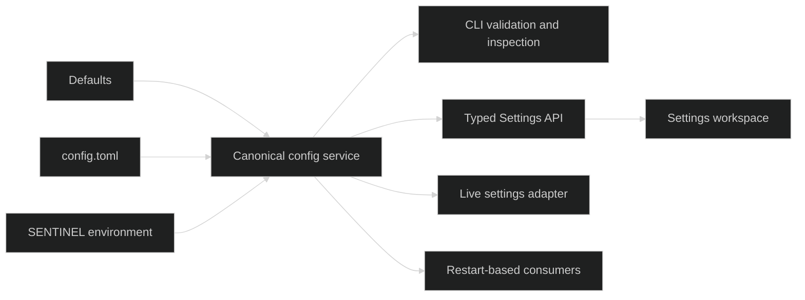

# Architecture

Sentinel is a local-first operational workspace for one host. A single Go
binary serves an embedded React application, the HTTP and WebSocket surfaces,
background owner services, and a local SQLite store.

## Product Boundaries

**Now** is the composition boundary. It reads current evidence from four owner
modules and produces posture, confidence, a bounded decision queue, live
context, and typed handoffs.

| Owner | Responsibility | Durable workflow state |
| --- | --- | --- |
| Tmux | Sessions, windows, panes, PTY interaction, activity projection | Session metadata and projections, not a cross-module workflow |
| Services | Unit discovery, tracked condition, logs, lifecycle action, post-condition verification | Tracked service definitions |
| Metrics | Live host/runtime samples and canonical pressure posture | None; detailed samples are a live diagnostic view |
| Runbooks | Procedure definition, target admission, parameters, schedules, approval, execution, receipt | Definitions, schedules, jobs, step results, and frozen receipts |

Now has no table, collector, timeline, or action executor of its own. A source
failure degrades the composed read without discarding evidence from healthy
owners. Action and verification stay in the owner responsible for them.

The conceptual flow is documented in
[Operational Loop](/features/operational-loop.md); exact HTTP and event
contracts live in [Reference](/reference/http-api.md).

## Runtime Shape

1. The configuration service loads deployment defaults, TOML definitions, and
   `SENTINEL_*` overrides while retaining each field's provenance.
2. One live settings adapter initializes from that effective state and is
   shared by metadata, the Settings API, and MCP availability.
3. The server establishes origin and optional shared-token policy.
4. SQLite-backed managers and live owner services start; the Tmux lifecycle
   controller reconciles persisted ephemeral MCP leases before its reaper runs.
5. The browser loads initial owner state over HTTP.
6. Shared operational events and the dedicated Tmux stream keep routes current.
7. Now recomposes owner evidence and returns the operator to a calm or
   actionable current picture.

The arrows describe ownership and information flow, not a shared incident state
machine.

## Implementation Components

- `cmd/sentinel` — process entrypoint.
- `internal/cli` — commands, help, completion, and formatted output.
- `internal/config` — canonical defaults, file/environment precedence,
  validation, revision, transactional persistence, and runtime apply boundary.
- `internal/server` — HTTP bootstrap, background lifecycle, and pinned-session
  restore.
- `internal/ui` — embedded SPA delivery.
- `internal/api` — HTTP handlers for metadata, Now, Tmux, and operational
  owners.
- `internal/ws` — browser terminal transport.
- `internal/events` — shared operational event hub.
- `internal/tmux` — Tmux command and account-targeting adapter.
- `internal/tmuxlifecycle` — persisted ephemeral MCP session leases,
  reconciliation, renewal, and exact-runtime cleanup.
- `internal/watchtower` — internal Tmux activity and unread projection.
- `internal/services` — systemd/launchd discovery, inspection, and actions.
- `internal/runbook` and `internal/scheduler` — definitions, execution,
  approval, receipts, and scheduling.
- `internal/store` — SQLite persistence.
- `internal/security` — shared-token, target-account, and origin validation.
- `internal/daemon` — systemd/launchd installation and lifecycle.
- `internal/report`, `internal/notify`, and `internal/updater` — auxiliary
  reporting, delivery, and installation maintenance.
- `frontend` — React/Vite routes for `/`, `/tmux`, `/runbooks`, `/services`,
  `/metrics`, `/settings`, and `/maintenance/storage`.

Auxiliary packages support the core owners; they are not additional top-level
product domains.

## State and Synchronization

HTTP establishes an initial snapshot. WebSocket events update owner caches and
invalidate Now when semantic owner state changes. Tmux uses its own PTY and
delta/event paths. Runbooks uses a bounded refresh sequence after a job starts
or resumes, and Tmux can fall back to polling while its events socket is
disconnected. These are reconciliation paths; the architecture is event-led,
not event-exclusive.

The server remains the source of truth. Optimistic presentation is limited to
the mutations whose owner contract can reconcile it safely.

## Persistence

SQLite stores definitions and records that must survive a process restart:

- Tmux session metadata, launchers, presets, and activity projections;
- active ephemeral MCP session leases, keyed by stable Tmux runtime ID;
- tracked services;
- Runbook definitions, schedules, jobs, step results, parameters, and receipt
  snapshots;
- bounded operational metadata described in the storage reference.

Now is computed on request. Detailed Metrics history is not a persisted
observability database.

`config.toml` is managed separately from SQLite. Startup, CLI, and API consume
one canonical configuration service. File updates use an advisory lock,
same-directory atomic replacement, a single adjacent `.bak`, and rollback when
runtime application fails. Environment overrides remain authoritative and
cannot be overwritten through a file mutation.

The public Settings boundary is only `GET` and `PATCH /api/ops/settings`.
Reads expose typed field state, provenance, lifecycle, and validation metadata,
never config-file contents or secret values. Writes require the current ETag and
are applied as one transaction; a revision conflict or live-application failure
leaves the winning file and runtime state intact. The shared live adapter
updates locale, timezone metadata, and MCP availability while restart-only
consumers continue to use the immutable process baseline.

The environment remains authoritative. The API can persist file-owned values,
but it cannot override an environment-owned field or make a restart-based
consumer adopt a new value before process restart.

## Deployment and Trust

- One binary and one host are the deployment boundary.
- Stopping Sentinel must not terminate the host's Tmux server or sessions.
- The optional token is one shared operator secret, not identity or RBAC.
- OS account targeting delegates process identity to the operating system.
- MCP uses the same trusted boundary; it is an extension, not another tenant.
- MCP Streamable HTTP remains stateless; persisted session leases belong to the
  Tmux resource lifecycle and survive transport/client reconnects.
- Shutdown stops the lifecycle reaper and drains Sentinel-owned control clients
  without terminating persistent or unrelated Tmux sessions.
- Cloud relay, fleet control, and SaaS storage are not part of the architecture.

## Current Non-goals

- Fleet or multi-host orchestration.
- SaaS observability and durable telemetry analytics.
- Incident, alert acknowledgement, or recovery-timeline engines.
- Sentinel application identities, roles, RBAC, tenants, scopes, or agent
  approval.
