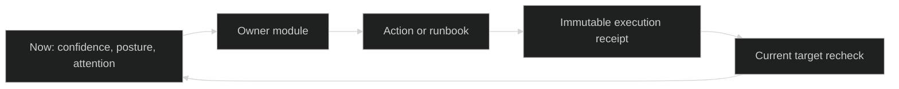

# Architecture

Sentinel is a single Go binary with embedded frontend assets and a local SQLite data plane.

## High-Level Components

- `cmd/sentinel`: thin entrypoint — wires args and the process exit code.
- `internal/cli`: command parsing, help, completion, and formatted output.
- `internal/server`: HTTP server bootstrap, background tickers, pinned-session restore.
- `internal/ui`: SPA delivery, embedded frontend assets and WebSocket endpoints.
- `internal/api`: authenticated HTTP API for Now, tmux, operations, and metadata.
- `internal/tmux`: tmux command adapter and behavior patches.
- `internal/watchtower`: activity collector and unread projection engine.
- `internal/store`: SQLite schema and persistence (sessions metadata, watchtower activity, runbooks, schedules, and services).
- `internal/notify`: webhook delivery with retry/backoff for runbook and health report notifications.
- `internal/report`: scheduled health report generation and webhook dispatch.
- `internal/runbook`: runbook definition parsing, step execution (run/script/approval), shell validation, and webhook dispatch.
- `internal/scheduler`: cron-based job scheduling and execution engine.
- `internal/term`: terminal abstraction and PTY lifecycle management.
- `internal/updater`: binary self-update checks and apply logic.
- `internal/validate`: shared input validators (session names, cron expressions, timezones).
- `internal/config`: TOML configuration loading with environment variable overrides (`SENTINEL_*`).
- `internal/security`: bearer token authentication and CORS origin validation.
- `internal/daemon`: systemd/launchd service install and lifecycle management.
- `frontend`: React/Vite frontend with file-based routing (TanStack Router), optimistic UX, and event-driven sync. Routes: `/`, `/tmux`, `/runbooks`, `/services`, `/metrics`.

## Runtime Flow

1. Server starts and loads config.
2. Security guard applies token/origin policy.
3. Watchtower and operations services start.
4. Frontend connects:
   - REST for initial snapshot (`/api/...`)
   - WebSocket for realtime updates (`/ws/events`)
   - PTY stream (`/ws/tmux`)
5. UI uses optimistic mutations and reconciles with events/patches.
6. Now (`/`) composes the current operating picture and hands work to the
   dedicated Tmux, Runbooks, Services, and Metrics routes.

## Now Read Model

`GET /api/now` is a thin composition layer over the four owner modules. Each
request fans out concurrently to the live Services probe, canonical Metrics
posture, Runbooks definitions/executions, and the shared enriched Tmux
projection. One failed source does not discard healthy results: the response
keeps a source envelope with `current`, `stale`, `unavailable`, or
`not_configured`. It derives evidence `confidence` from all four sources and
host `posture` from current Services and Metrics evidence.

Now has no database table, background collector, server cache, or independent
event. Attention ordering, deduplication, and display limits are pure read-model
rules. The procedure action reuses the Runbook Manager, so persistence and
notifications continue through the existing `ops.job.updated` lifecycle. Owner
modules remain responsible for status/log inspection, approvals, terminal
interaction, and metric diagnosis.

The frontend loads this model once over HTTP, then invalidates it from the
existing owner events. It has no periodic polling. If the shared event socket
disconnects while a snapshot is retained, the presentation marks current
source envelopes stale until a successful refresh.

The arrows are ownership boundaries, not a shared workflow table. Now owns
composition and handoff; Services owns current condition, logs, and lifecycle
verification; Metrics owns temporal posture; Runbooks owns confirmation,
target admission, approval, and immutable receipts; Tmux owns terminal context.
Only Runbook executions are durable workflow records.

## Data Model (Operational)

- Session metadata
- Watchtower projections:
  - session-level unread/activity state
  - window unread flags
  - pane revision/seen revision
  - journal revisions (`global_rev`) for delta sync
  - live presence
- Ops runbooks, runs, schedules, and parameters
- Session directory frequency tracking
- Session users registry (`session_users`)
- Tmux launchers with user targeting (`tmux_launchers`)
- Session presets (`session_presets`)

## Event-Driven UX Strategy

Primary path is WS events:

- `tmux.sessions.updated`
- `tmux.inspector.updated`
- `tmux.activity.updated`
- `ops.overview.updated`
- `ops.services.updated`
- `ops.metrics.updated`
- `ops.posture.updated`
- `ops.runbooks.updated`
- `ops.schedule.updated`
- `ops.job.updated`

Fallback HTTP polling is used only when events channel is disconnected.

## Design Principles

- Single-binary deployment.
- Independent tmux lifecycle: Sentinel may discover and control tmux, but its
  service stopping must not terminate the tmux server, sessions, panes, or
  their processes.
- No cloud relay by default.
- Optimistic frontend interactions for responsiveness.
- Server remains source of truth through projections and event patches.
- Dedicated pages per concern: each operational feature has its own route, sidebar, and help dialog for focused workflows.
